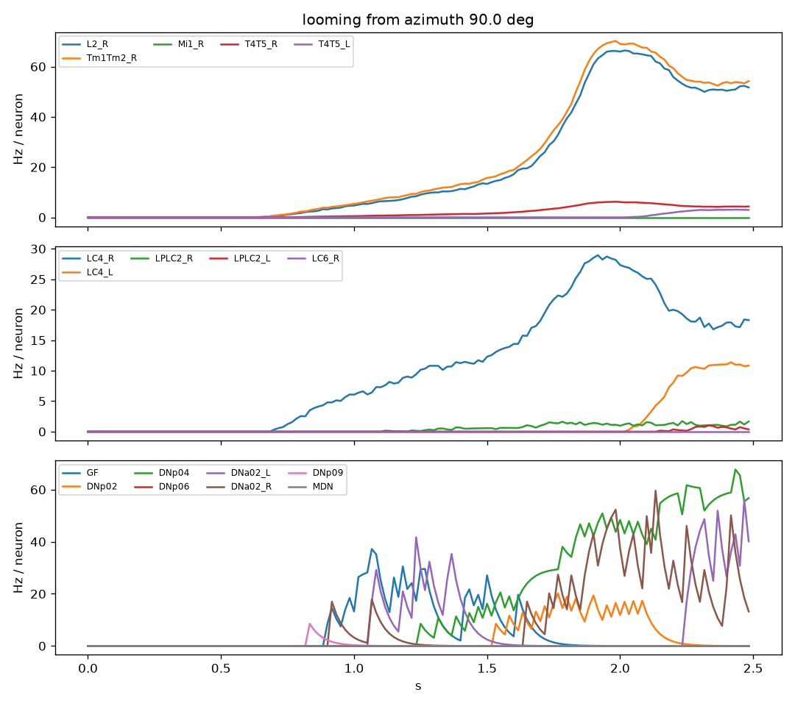

# fly-survivors

A whole-brain simulation of the fruit fly (*Drosophila melanogaster*), built from the
FlyWire connectome, that will play **Vampire Survivors**.

138,639 neurons and 15 million connections are simulated as leaky integrate-and-fire
units on the GPU. The goal: feed the game screen into the fly's eyes, read the
descending neurons that drive walking, and let the fly's own escape reflexes keep it
alive in a bullet-heaven game.

## Status

- [x] Connectome loader (FlyWire v783, via the files of Shiu et al. 2024)
- [x] LIF whole-brain simulator, all 15 M synapses, PyTorch + Triton, CUDA-graph captured
- [x] Validation against the original Brian2 model: sugar-sensing neurons -> proboscis
      motor neuron MN9 at 90 Hz (reference: 88 Hz), ~400 active neurons, same top neurons
- [x] Real time: 80 us per 0.1 ms step on an RTX 4080 SUPER (1.2x real time)
- [x] Eye columns: 796 + 788 columns with viewing directions, every L1/L2/L3/Tm/T4/T5
      assigned to its column through the connectome
- [x] Virtual eye: player-centred frame -> ground-plane projection -> per-column
      contrast -> Poisson drive on the fly's own visual neurons
- [x] Motor readout: DNa02 / DNp09 / MDN / giant fiber rates -> heading and speed
- [x] Closed loop on a synthetic scene: a dark object approaching from the right fires
      LC4 -> DNp04 -> giant fiber and turns the fly away, all inside the connectome
- [ ] Vampire Survivors integration (dxcam + vgamepad), level-up menu handling, gain tuning
- [ ] Live visualization of the brain while it plays

## Quick start

```bash
python -m venv .venv
.venv\Scripts\activate
pip install torch --index-url https://download.pytorch.org/whl/cu128
pip install triton-windows                # Triton on Windows (Linux: pip install triton)
pip install -e .[dev]
python scripts/download_data.py        # ~140 MB, once
python scripts/validate_proboscis.py   # sugar GRNs -> MN9
python scripts/benchmark.py            # speed on your GPU
python scripts/demo_looming.py --azimuth 90 --radius 1.2 --rate 250   # eye -> brain -> motor
python scripts/probe_pathway.py --activate LC4,LPLC2 --side right     # stimulate any cell type
pytest                                 # unit tests (synthetic networks + eye geometry on CPU)
```

## Model

Same equations and constants as Shiu et al. 2024 (Brian2 model), reimplemented with a
fixed 0.1 ms step and no host-side control flow so a whole step runs as one CUDA graph:

```
dv/dt = (v_rest - v + g) / tau_m         v_rest = v_reset = -52 mV, v_th = -45 mV, tau_m = 20 ms
dg/dt = -g / tau_syn                     tau_syn = 5 ms
spike: v = v_reset, g = 0, refractory 2.2 ms
presynaptic spike: g_post += 0.275 mV * signed synapse count, after 1.8 ms
```

Excitatory / inhibitory sign comes from the predicted neurotransmitter of the
presynaptic neuron (GABA and glutamate inhibitory). "Optogenetic" activation of a set
of neurons is Poisson spiking at a chosen rate, as in the reference.

One detail that matters: in the Brian2 reference, synaptic input arriving while a
neuron is refractory is dropped, not accumulated. Accumulating it makes the whole
network ~25% more excitable (MN9 at 112 Hz instead of 88 Hz). This model drops it too.

`scripts/reference_brian2.py` runs the original Brian2 model on the same experiment
(slow, CPU) to compare numbers.

### Speed

| Backend | Propagation | us / step | real time |
|---|---|---|---|
| torch | CSR sparse mat-vec over all 15 M edges | 376 | 0.27x |
| triton | event-driven, only out-edges of neurons that spiked | 80 | 1.2x |

Only a few dozen neurons spike per 0.1 ms step, so touching all edges every step is
wasted work. The Triton kernel launches one program per presynaptic neuron; programs
whose neuron is silent exit immediately. A second fused kernel does the LIF update,
Poisson forcing and the delay ring-buffer write. The whole step is replayed as one
CUDA graph. Triton on Windows comes from the `triton-windows` package.

## Eye

Every ommatidium of the compound eye feeds one column that runs through the lamina and
medulla. The right eye's 796 columns have published hexagonal coordinates (Matsliah et
al. 2024, via OpticLobe.jl); we map lattice position to viewing direction (~5.5 deg per
column) and propagate the column of each Mi1 to L1, R1-6, L2, L3, Tm1, Tm2, ..., T4, T5
through the connectome: a cell takes the column of the partner it shares the most
synapses with. The left eye has no public lattice, so left Mi1 somata are mirrored
across the midline and matched one-to-one to right columns (coarser: about half of
nearest-neighbour pairs land within two lattice steps, vs 80% on the right).

The virtual eye puts the fly on the game's ground plane at the player's position. A
column looking below the horizon at elevation `el` sees the ground at distance
`eye_height / tan(-el)` in its azimuth direction, through a Gaussian receptive field. An
approaching enemy slides down the eye and covers more columns: it looms. The frame is
resampled into the fly's frame for the current heading, one sparse mat-vec gives the
intensity of every column, and contrast relative to the scene mean becomes a Poisson
rate on the visual neurons of that column.

### Where to inject, and why

The lamina in FAFB is under-reconstructed and the photoreceptor synapses are mis-signed
in the model (histamine is inhibitory, predicted mostly excitatory), and a fixed-delay
LIF network does not compute motion, so T4/T5 never fire from earlier stages. Measured
with `probe_pathway.py` (Poisson activation of a cell type on the right, 0.5 s):

| Activated (right)         | LC4_R | LPLC2_R | GF  | DNp04 | DNa02_L | DNa02_R |
|---------------------------|-------|---------|-----|-------|---------|---------|
| L1 + L2 + L3, 150 Hz      | 0     | 0       | 0   | 0     | 0       | 0       |
| Tm1 + Tm2 + Tm4 + Tm9     | 69    | 0       | 3   | 58    | 28      | 10      |
| T4 + T5, 100 Hz           | 0     | 44      | 77  | 38    | 20      | 32      |
| LC4 + LPLC2, 100 Hz       | 100   | 100     | 128 | 91    | 38      | 0       |

So dark contrast is injected, retinotopically, into the medulla OFF cells Tm1/Tm2/Tm4/Tm9
(and the lamina cells, for realism). From there the connectome does the rest: LC4 dark-object
detectors, DNp02/DNp04/DNp06, the giant fiber, and a DNa02 turn away from the object's side.



## Motor readout

Descending neuron groups are read as smoothed mean rates (50 ms): DNa02 left/right
(ipsilateral turning), DNp09 (forward walking), MDN (backward), DNp01 = giant fiber
(escape). `Locomotion` integrates them into a heading and a signed speed, i.e. a
gamepad stick vector. Gains live in `LocomotionParams` and will be tuned on the game.

## Layout

```
src/flysurvivors/connectome.py   load + cache the edge list, id <-> index mapping
src/flysurvivors/lif.py          LIFBrain: state, torch reference step, CUDA graph capture, run()
src/flysurvivors/kernels.py      Triton kernels: event-driven propagation + fused LIF update
src/flysurvivors/neurons.py      known root ids (sugar GRNs, MN9)
src/flysurvivors/annotations.py  cell types / sides / positions (Schlegel et al. 2024)
src/flysurvivors/columns.py      eye columns, viewing directions, LC receptive fields
src/flysurvivors/eye.py          VirtualEye (frame -> columns), RetinaDrive (columns -> rates)
src/flysurvivors/motor.py        MotorReadout (DN rates), Locomotion (heading, speed)
scripts/                         download, validation, benchmark, reference, looming demo, probe
tests/                           synthetic networks (delay, refractory, summation), eye geometry
```

## Data and credits

- Connectome: FlyWire (Dorkenwald et al. 2024, Schlegel et al. 2024), version 783.
  FlyWire data is released for non-commercial use with attribution; see flywire.ai.
- Annotations: Schlegel et al. 2024, github.com/flyconnectome/flywire_annotations.
- Right-eye column lattice: Matsliah et al. 2024, via github.com/hsseung/OpticLobe.jl (MIT).
- Model and data files: Shiu et al. 2024, *A leaky integrate-and-fire computational
  model based on the connectome of the entire adult Drosophila brain reveals insights
  into sensorimotor processing* (Nature), code at github.com/philshiu/Drosophila_brain_model (MIT).
- Vampire Survivors is a game by poncle. This project sends inputs to a locally running
  copy and is not affiliated with it.

## License

MIT for the code in this repository. The connectome data keeps its own license.
